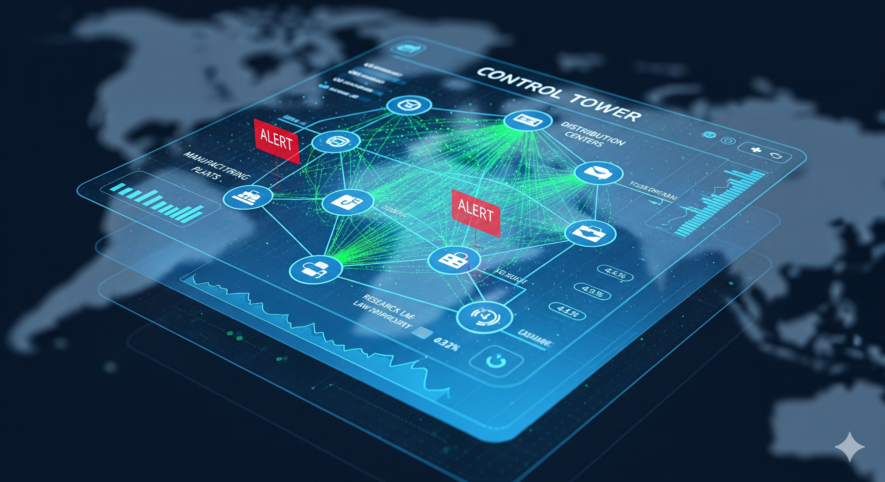

# 🛡️ RESILIO: The Cognitive Supply Chain Engine



**Agentic GraphRAG for Pharmaceutical Resilience**

**Status:** 🏆 5-Day Gen AI Intensive Course with Google Capstone Submission  
**Track:** Enterprise / Business  
**Deployment:** [Link to Video Demo]

---

## 🚨 The Business Problem

Pharma supply chains are fragile. Yet, the current landscape of tools leaves critical gaps in **Time-to-Insight**:

- **Legacy SCRM** (e.g., Resilinc) relies on manual mapping and qualitative scorecards, often detecting risks **days after they occur**.
- **Logistics Tools** (e.g., Everstream) track shipments well but lack the manufacturing context to calculate the **financial impact** of a raw material shortage.
- **Planning Systems** (e.g., SAP IBP or Kinaxis RapidResponse) are powerful systems of record but are **"blind" to unstructured data** (news, social media) until a human manually inputs the disruption.

While Generative AI offers a potential bridge, **standard RAG chatbots fail to address this unmet need** in the enterprise because they are:

- **"Frozen in Time"** - Training data cutoff means they miss real-time events
- **"Deterministic"** - They cannot verify if a fire reported on Twitter is real
- **"Unaware"** - They cannot pinpoint a factory's exact location relative to a hurricane

---

## 💡 The Solution: Resilio

Resilio is a **Cognitive Supply Chain Engine**. It moves beyond "Chat with PDF" to perform **Level 3 Agentic Reasoning** by combining:

- **Unstructured Intelligence** (News extraction via Gemini 2.5 Flash)
- **Geospatial Verification** (NASA Satellite Data)
- **Structured Reasoning** (NetworkX Graph Traversal)
- **Probabilistic Math** (Monte Carlo Risk Simulation)

---

## 🎓 Course Concepts Applied

This project demonstrates the application of **5 Key Concepts** from the AI Agents Intensive:

| Course Concept | Implementation in Resilio |
|----------------|---------------------------|
| **1. Multi-Agent Systems** | Sequential Architecture: We orchestrated 5 specialized agents (Sentinel → Detective → Quantifier → Strategist → Auditor) using LangGraph. |
| **2. Tool Use (Function Calling)** | Hybrid Tooling: We integrated custom Python tools (Graph Traversal, Monte Carlo Math) alongside external APIs (Tavily, NASA EONET) to ground the LLM in reality. |
| **3. Agent Evaluation** | The Auditor Node: We implemented an "LLM-as-a-Judge" node that scores the faithfulness (0-5) of the strategy before presenting it to the user. |
| **4. State Management** | TypedDict Schema: We used a structured `AgentState` to persist complex context (Entity IDs, Risk Distributions, Verification Logs) across the workflow steps. |
| **5. Reasoning Loops** | Self-Correction: If the Auditor rejects a plan (Safety Check Fail), the workflow utilizes a Conditional Edge to loop back to the Sentinel for re-extraction. |

---

## 🛠️ Architecture: The "Truth Sandwich"

To solve the enterprise hallucination problem, we wrap every LLM generation in **deterministic code layers**:

### Layer 1: Live Verification (Gemini + Tools)

The **Sentinel Agent** uses **Google Gemini 2.5 Flash** to extract events, but validates them immediately:

- **Tavily Search**: Confirms the event exists in reputable news sources
- **NASA EONET**: Checks satellite data for thermal anomalies (Fires) or storm tracks (Hurricanes) at the specific coordinates

### Layer 2: Entity Grounding (Graph)

The extracted entity string is **forced to match** a valid node ID in our NetworkX Knowledge Graph. If the entity is not in our supply chain, the alert is dropped.

### Layer 3: Probabilistic Math (Monte Carlo)

Instead of asking the LLM to guess financial impact, the **Quantifier Agent** runs **1,000 Monte Carlo simulations** in Python. It calculates the "Time-to-Survive" (Inventory Gap) to output a **P5-P95 confidence interval** for revenue loss.

---

## 🔄 Agent Workflow (LangGraph)

```
Sentinel (Detect) → Detective (Trace) → Quantifier (Calculate) → Strategist (Decide) → Auditor (Verify)
```

### Workflow Diagram



The workflow diagram above illustrates the complete multi-agent system architecture, showing how each agent processes information and passes it to the next stage in the pipeline.

### Agent Descriptions

1. **📡 Sentinel Agent** - Detect & Verify
   - Scans news input for supply chain disruptions
   - Uses **Gemini 2.5 Flash** with Tavily (web search) and NASA EONET (geospatial verification)
   - Maps events to entities in the knowledge graph

2. **🕵️ Detective Agent** - Trace Impact
   - Traverses the knowledge graph using **Breadth-First Search (BFS)**
   - Finds impacted products downstream
   - Detects hidden dependencies (e.g., Saline → CAR-T)

3. **📊 Quantifier Agent** - Calculate Risk
   - Runs **Monte Carlo simulation** (1000 iterations)
   - Calculates financial risk ranges (P5, Expected, P95)
   - Computes inventory gap days

4. **🎯 Strategist Agent** - Recommend Action
   - Analyzes risk magnitude and event type
   - Generates context-specific recommended actions

5. **⚖️ Auditor Agent** - Validate & Approve
   - Validates entity grounding (hallucination check)
   - Verifies math integrity
   - Approves or blocks results for presentation

---

## 🚀 Development Journey

Our journey to building Resilio followed **three phases of discovery**, addressing critical enterprise adoption barriers:

### The Hallucination Trap (Reliability)

Early prototypes using simple RAG would hallucinate suppliers or fail to distinguish between a "Fire near a factory" and "Fire at a factory."

**Pivot:** We moved from semantic search to **Deterministic Entity Grounding**. We stress-tested the system with ambiguous inputs (e.g., "Storm near Mock Town") and enforced a Python-based fuzzy match against our graph. This reduced false positives to near-zero, ensuring the "Control Tower" only lights up for verified network hits.

### The Math Problem (Accuracy)

We found that LLMs are unreliable at arithmetic, often inventing financial losses. In an enterprise setting, a wrong number is worse than no number.

**Pivot:** We stripped the math capabilities out of the LLM and into a **Python Tool**. We implemented a **Monte Carlo Simulation** (1,000 replications) to model demand volatility and recovery uncertainty. This allows us to present a **Confidence Interval (P5-P95)** rather than a guess, aligning with how Risk Managers actually assess exposure.

### The Trust Gap (Explainability)

Supply chain leaders told us they wouldn't trust a "Black Box" recommendation like "Buy more inventory."

**Pivot:** We focused on **Explainable AI (XAI)** via the Dashboard. By adding features like hover-over Lead Times on the graph edges and a visible "Auditor Validation Log," we exposed the agent's reasoning chain. Users can now trace the logic: **Event Detected → Satellite Verified → Path Traced → Math Calculated → Action Recommended**.

---

## 🚀 Installation & Usage

### Option 1: Local Execution

**1. Clone the repository:**

```bash
git clone https://github.com/codingnoodle/resilio.git
cd resilio
```

**2. Install dependencies:**

```bash
pip install -r requirements.txt
```

**3. Set API Keys (Linux/Mac):**

```bash
export GOOGLE_API_KEY="your_key"
export TAVILY_API_KEY="your_key"
```

**4. Run the Control Tower:**

```bash
streamlit run ui/dashboard.py
```

Open `http://localhost:8501` in your browser.

### Option 2: Docker Deployment (Cloud Bonus)

Deploy Resilio as a microservice on Google Cloud Run.

**Build Container:**

```bash
docker build -t resilio-app .
```

**Run Container:**

```bash
docker run -p 8080:8080 \
  -e GOOGLE_API_KEY="your_key" \
  -e TAVILY_API_KEY="your_key" \
  -e PORT=8080 \
  resilio-app
```

**Deploy to Google Cloud Run:**

```bash
gcloud run deploy resilio \
  --source . \
  --platform managed \
  --region us-central1 \
  --allow-unauthenticated \
  --set-env-vars GOOGLE_API_KEY="your-key",TAVILY_API_KEY="your-key"
```

---

## ⚙️ Configuration

### Zero-Dependency Mode (Mock)

Set `USE_REAL_LLM = False` in `src/resilio_core.py` to run in deterministic mock mode (no API calls required).

**Valid inputs in Zero-Dependency Mode:**
- **Locations:** North Carolina, Rocky Mount, North Cove, New Jersey, Mock Town, Mumbai, Rotterdam
- **Partners:** Pfizer, Baxter, Janssen, PharmaCorp, India
- **Disruptions:** Fire, Tornado, Hurricane, Strike, Floods, Logistics

### Real LLM Mode

Set `USE_REAL_LLM = True` and ensure API keys are set. The system will use:

- **Google Gemini 2.5 Flash** for entity/event extraction
- **Tavily Search** for web verification
- **NASA EONET** for geospatial verification

---

## 🧪 Testing & Validation

Run the automated test suite to verify the Anti-Hallucination Guardrails:

```bash
python src/testing.py
```

**Test Coverage:**
- ✅ Entity grounding (fuzzy matching)
- ✅ Location-priority logic
- ✅ Probabilistic math integrity
- ✅ Hallucination prevention
- ✅ Internal BioTherapy scenario
- ✅ Multiple event types per location

---

## 📂 Project Structure

```
resilio/
├── src/
│   ├── resilio_core.py      # The "Brain" - Graph, Agents, Monte Carlo engine
│   └── testing.py           # Unit tests for risk math and grounding logic
├── ui/
│   ├── dashboard.py         # The Streamlit "Control Tower" interface
│   └── workflow_diagram.svg  # Multi-agent workflow diagram
├── Dockerfile               # Container configuration
├── requirements.txt         # Python dependencies
├── README.md                # This file
└── RISK_CALCULATION_EXPLAINED.md  # Detailed risk calculation methodology
```

### Key Files

- **`src/resilio_core.py`** - Main application logic, agents, knowledge graph
- **`ui/dashboard.py`** - Streamlit UI with visualizations
- **`src/testing.py`** - Unit tests

---

## 📊 Knowledge Graph Structure

### Locations
- **Mock Town, NJ (USA)** - Internal manufacturing facility
- **North Cove, NC (USA)** - Partner B facility
- **Rocky Mount, NC (USA)** - Partner C facility
- **Mumbai, India** - Partner D facility
- **Rotterdam, EU** - Logistics hub

### Entities
- **PharmaCorp A (Internal)** - Internal manufacturing
- **PharmaCorp B (Tier 1 Partner)** - IV Fluid supplier
- **PharmaCorp C (Tier 1 Partner)** - Sterile injectable supplier
- **PharmaCorp D (Tier 2 Partner)** - Raw material supplier
- **EU Logistics** - European logistics partner

### Products
- **Product X BioTherapy** - Finished BioTherapy product (CAR-T proxy)
- **Product Y Sterile** - Sterile injectable component
- **Product Z Commodity** - Critical commodity component

### Ingredients
- **BioTherapy Raw** - BioTherapy precursor material
- **API Generic Raw** - Generic API raw material

---

## 📚 Citations & Data Sources

- **Supply Chain Data**: Synthetic ontology modeled after the FDA Drug Safety Communication: Pfizer Rocky Mount Tornado Damage (https://www.nbcnews.com/health/health-news/tornado-struck-pfizer-plant-ripped-warehouse-drugs-stored-rcna95384)
- **Satellite Data**: [NASA Earth Observatory Natural Event Tracker (EONET) API](https://eonet.gsfc.nasa.gov/)
- **Search**: [Tavily AI](https://tavily.com/) for agent-optimized web search
- **LLM**: [Google Gemini 2.5 Flash](https://ai.google.dev/models/gemini) via LangChain

---

## 📚 Documentation

- **[Risk Calculation Explained](RISK_CALCULATION_EXPLAINED.md)** - Detailed methodology for Monte Carlo simulation
- **Dashboard Guide** - Interactive UI with knowledge graph visualization

---

## 📝 License

MIT License

---

## 🤝 Contributing

Contributions welcome! Please open an issue or submit a pull request.

---

## 📧 Contact

For questions or issues, please open an issue on [GitHub](https://github.com/codingnoodle/resilio).
